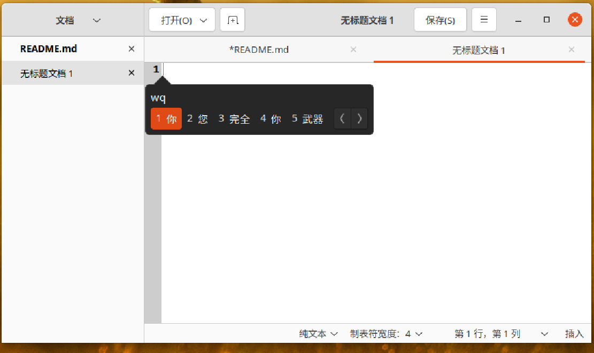
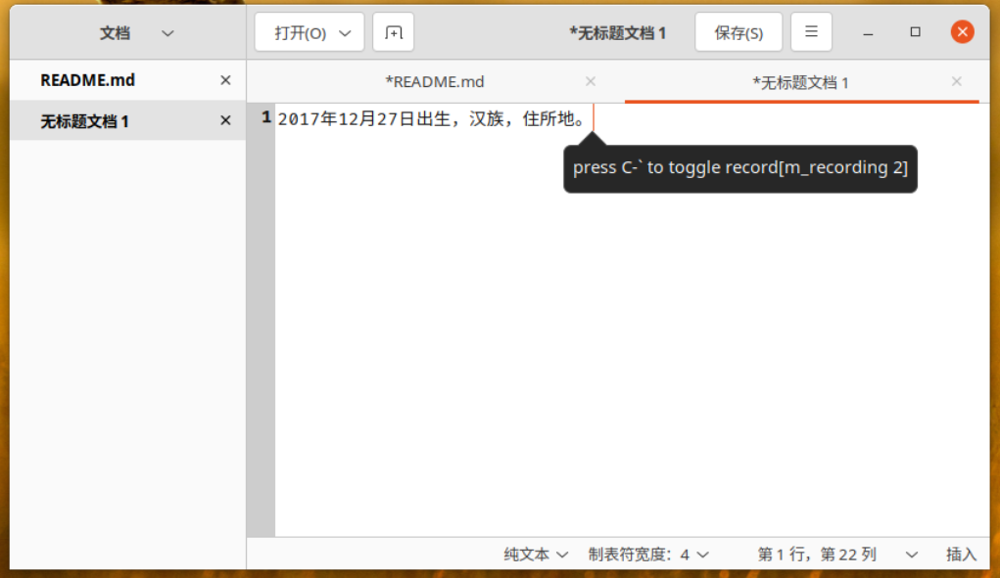
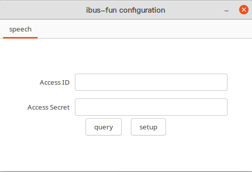
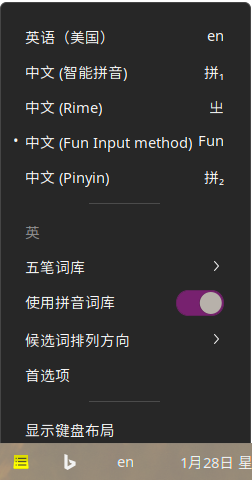
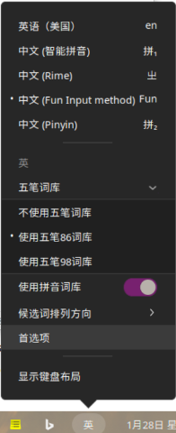
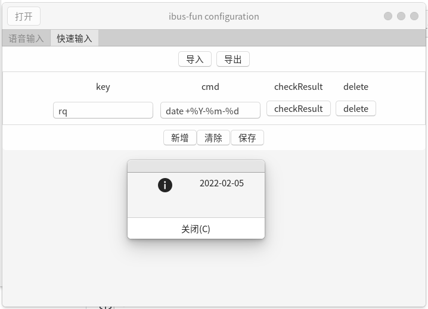

# Fun中文输入法

# Intruction

一个Linux下的基于IBus的,支持五笔拼音混输, 支持单纯拼音输入,支持五笔输入,还支持语音输入的输入法.


Code under pinyin folder and dictionary file res/dict_pinyin.dat come from [Google pinyin IME](https://android.googlesource.com/platform/packages/inputmethods/PinyinIME).


# Build and Install

这是一个cmake工程,所有用正常的cmake编译就行了.

```bash
mkdir build
cd build
cmake ..
make
sudo make install
```

你也可以先构建一个deb包, 然后再安装deb包:

```bash
mkdir build
cd build
cmake ..
make
cpack
sudo dpkg -i audio_ime-1.1-Linux.deb

```

# Snapshots

## 五笔拼音混输界面

五笔和拼音可以单独打开和关闭, 关闭五笔就是一个拼音输入法, 关闭拼音就是一个五笔输入法.

五笔可以选择86版五笔还是98版五笔.



## 语音输入界面

语音输入, 使用的是阿里云的一句话识别API, 需要用户自己花一块钱买一个一年3万次的服务包. 并在配置界面输入id和secret.
后续考虑把我自己的置入. 语音输入激活的快捷键是`ctrl + \``.



## 输入id和secret的界面



## 简单的配置界面

可以选择打开和关闭拼音或五笔, 可以选择候选词排列的方向.





## 快速输入配置界面




